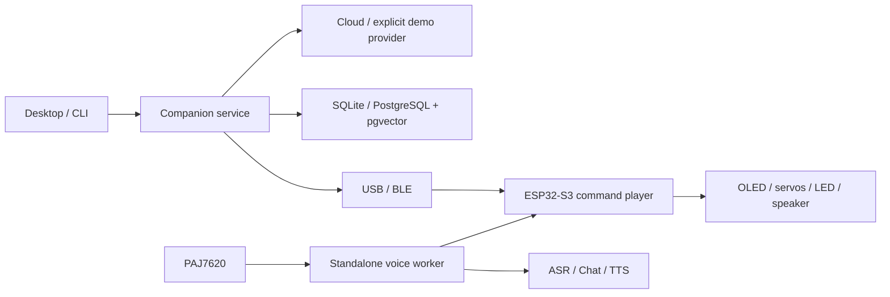

# Emobot Companion

A bilingual desktop companion with long-term memory, document retrieval and a real ESP32-S3 robot interface. This portfolio edition rebuilds the jointly developed [Emobot](https://github.com/Smh-GOAT/Emobot) around explicit service boundaries, validated commands and repeatable tests.


## Try it without hardware or API keys

Use Python 3.13.x. Tk is required only for the desktop window. Package metadata and CI target the 3.13 series.

```bash
# macOS / Linux
python3.13 -m venv .venv
source .venv/bin/activate
# Windows: py -3.13 -m venv .venv
#          .venv\Scripts\activate
python -m pip install -e .
emobot --demo chat "你好，介绍一下你自己"
emobot --demo gui
```

Demo mode is visibly labeled and uses a deterministic local provider. The real model, speech and robot adapters remain available through the same application services.

For real conversations, open **Settings / API 设置**, enter an OpenAI-compatible HTTPS base URL, API key, fast model and fallback/retrieval model; then start `emobot gui`. Providers' model access and billing depend on your own account. Environment variables such as `EMOBOT_API_KEY`, `EMOBOT_FAST_MODEL`, `EMOBOT_LANGUAGE` override the private settings file.

## Features

- Chinese and English responses; editable persona; light, dark and system themes.
- Multi-turn chat with automatic fallback when the fast model fails or returns invalid JSON.
- Durable user preferences, manual memory CRUD, user-scoped storage and explicit forgetting.
- Markdown import, idempotent updates, embedding indexing and hybrid keyword/vector retrieval; keyword documents remain searchable during embedding outages.
- SQLite out of the box; optional PostgreSQL with pgvector and configurable dimensions.
- USB at 115200 baud and BLE using the existing characteristic UUID; bounded newline framing and delivery acknowledgments.
- All **59** action names: 7 eye expressions, 9 head movements, 42 animated symbols and delay.
- Microphone transcription and speaker synthesis; 6 OpenAI voices and configurable Volcano TTS.
- Calibration, enable/disable, device address, Wi-Fi reset and firmware flashing with explicit image offsets.
- Standalone ESP32-S3 gesture → microphone → Qwen ASR → chat → robot action → ByteDance streaming PCM speech; Wi-Fi provisioning, UDP discovery, local 10-turn history and status LED.

Install optional integrations as needed:

```bash
python -m pip install -e '.[voice,postgres,flash]'
emobot doctor
emobot import-docs README.md docs/HARDWARE.md docs/USAGE.md
emobot index  # requires configured embeddings; not needed for keyword retrieval
```

## Architecture



`src/emobot` contains the Python application. `firmware/EmobotS3` contains the new device implementation. GUI operations run on one worker; a queue returns results to the Tk thread. Robot commands are allowlisted, bounded by duration and checked again on the device. Hardware and network initialization occur explicitly, never during module import.

## Firmware

Install PlatformIO, configure `firmware/EmobotS3/secrets.h` from the ignored example, and use an ESP32-S3 board with 8 MB flash. USB/BLE controls work without Wi-Fi or cloud keys. Standalone cloud voice additionally requires Wi-Fi, current trusted root CAs, provider access, wired audio modules and initialized FFat. See [hardware/build guide](docs/HARDWARE.md).

```bash
python -m pip install platformio==6.1.18
pio run
pio run -t upload
pio device monitor -b 115200
```

## Verification and portfolio notes

Four sequential review/fix rounds are recorded in [review 1](docs/REVIEW-1.md), [review 2](docs/REVIEW-2.md), [review 3](docs/REVIEW-3.md) and [review 4](docs/REVIEW-4.md). [Validation](docs/VALIDATION.md) distinguishes automated checks from hardware/cloud checks still requiring your equipment. [Feature mapping](docs/FEATURE-MAP.md) traces the existing features to their new implementation. [Interview notes](docs/PORTFOLIO.md) explain design decisions without inventing individual authorship.

```bash
python -m pip install -e '.[dev]'
pytest -q
ruff check src tests tools
ruff format --check src tests tools
python -m build
pio run
```

This is a GPLv3 portfolio edition of a jointly originated project, with retained animation assets and AI-assisted implementation work. Read [credits and lineage](NOTICE.md). The source similarity report separates newly written logic from intentionally shared artwork, license text and compatibility identifiers.
